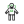
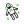
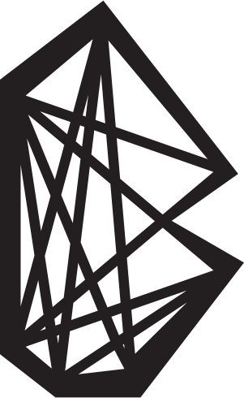
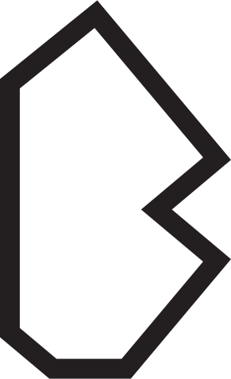
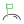
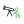
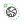
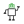
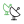

## These are the fonts for BenchFont 1.0.3.

You should find the following in this folder:

- `benchfont.eot`
- `benchfont.svg`
- `benchfont.ttf`
- `benchfont.woff`

## BenchFont Cheatsheet

| bench-icon | class | character-map | description |
|------------|-------|---------------|-------------|
||bench-abduction|a|Abduction Icon|
||bench-alien-2|b|Alien-2 Icon|
||bench-alient-face|c|Alien Face Icon|
||bench|d|Bench Logo Icon|
||bench-astronaut|e|Astronaut Icon|
||bench-astronaut-2|f|Astronaut 2 Icon|
||bench-astronaut-helmet|g|Astronaut Helmet Icon|
||bench-2|h|Bench Logo 2 Icon|
||bench-3|i|Bench Logo 3 Icon|
||bench-benchtrade|j|BenchTrade App Logo Icon|
||bench-comet|k|Comet Icon|
||bench-constellation|l|Constellation Icon|
||bench-dapps|m|dApp Icon|
||bench-dbrowser|n|dBrowser Logo Icon|
||bench-dmail|o|dMail Logo Icon|
||bench-dmemo|p|dMemo Logo Icon|
||bench-dmemo-2|q|dMemo Logo 2 Icon|
||bench-dmusic|r|dMusic Logo Icon|
||bench-docchain|s|DocChain Logo Icon|
||bench-dpages|t|dPages Logo Icon|
||bench-dpages-2|u|dPages Logo 2 Icon|
||bench-dread|v|dRead Logo Icon|
||bench-dvideo|w|dVideo Logo Icon|
||bench-earth|x|Earth Icon|
||bench-flag-on-moon|y|Flag On Moon Icon|
||bench-galaxy|z|Galaxy Icon|
||bench-globe|A|Globe Icon|
||bench-half-moon|B|Half Moon Icon|
||bench-looking-telescope|C|Looking Out A Telescope Icon|
||bench-mailchain|D|MailChain Logo Icon|
||bench-mailchain2|E|MailChain Logo 2 Icon|
||bench-man-setting-flag|F|Man Setting Flag Icon|
||bench-man-with-flag|G|Man With Flag Icon|
||bench-measurement|H|Measurement Icon|
||bench-moon|I|Moon Icon|
||bench-moon-and-stars|J|Moon and Stars Icon|
||bench-moon-orbitting|K|Moon Orbitting Icon|
||bench-musicchain|L|MusicChain Logo Icon|
||bench-musicchain2|M|Music Chain Logo 2 Icon|
||bench-new-moon|N|New Moon Icon|
||bench-orbit|O|Orbit Icon|
||bench-planet|P|Planet Icon|
||bench-planet-2|Q|Planet 2 Icon|
||bench-orbitting|R|Planets Orbitting Icon|
||bench-readchain|S|ReadChain Logo Icon|
||bench-robot|T|Robot Icon|
||bench-robot-2|U|Robot 2 Icon|
||bench-rocket|V|Rocket Icon|
||bench-rocket-2|W|Rocket 2 Icon|
||bench-rocket-launched|X|Rocket Launched Icon|
||bench-satellite|Y|Satellite Icon|
||bench-satellite-2|Z|Satellite 2 Icon|
||bench-saturn|@|Saturn Icon|
||bench-sharechain|>|ShareChain Logo Icon|
||bench-shopchain|<|ShopChain Logo Icon|
||bench-solar-system|?|Solar System Icon|
||bench-gun|-|Space Gun Icon|
||bench-rocket|=|Space Rocket Icon|
||bench-space-shuttle|+|Space Shuttle Icon|
||bench-space-shuttle-2|1|Space Shuttle 2 Icon|
||bench-space-shuttle-3|2|Space Shuttle 3 Icon|
||bench-space-vehicle|3|Space Vehicle Icon|
||bench-star|4|Star Icon|
||bench-star-falling|5|Star Falling Icon|
||bench-abduction|6|Star Orbitting Earch Icon|
||bench-stars|7|Stars Icon|
||bench-stars-2|8|Stars 2 Icon|
||bench-sun|9|Sun Icon|
||bench-sun-and-planets|0|Sun and Planets Icon|
||bench-telescope|^|Telescope Icon|
||bench-telescope-1|{|Telescope App Icon|
||bench-two-satellites|}|Two Satellites Icon|
||bench-videochain|:|VideoChain Logo Icon|
||bench-weapon|/|Weapon Icon|
||bench-x|)|X App Logo Icon|
